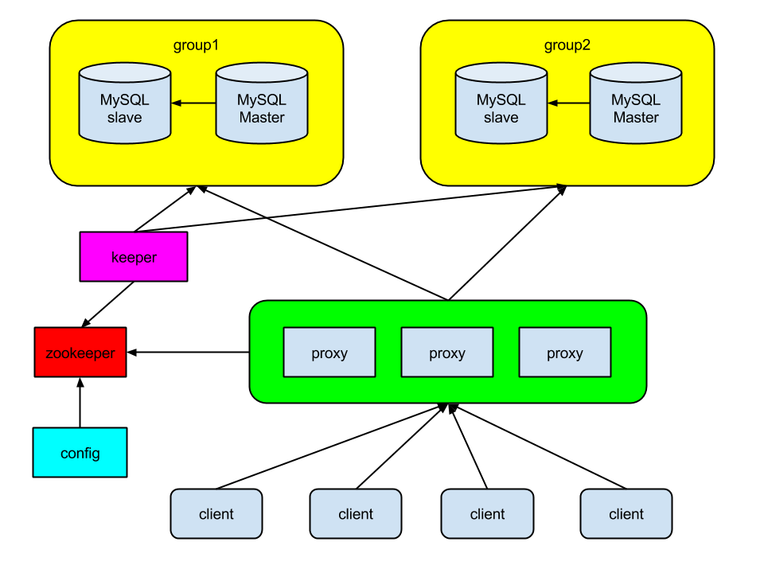

# Myshard   

Yet another MySQL proxy with Go. 

 

## Install

    cd $WORKSPACE
    git clone git@github.com:go-cloud/myshard.git src/github.com/go-cloud/myshard
    
    cd src/github.com/go-cloud/myshard

    ./bootstrap.sh

    make
    make test

## Feature

## Feedback

+ siddontang@gmail.com